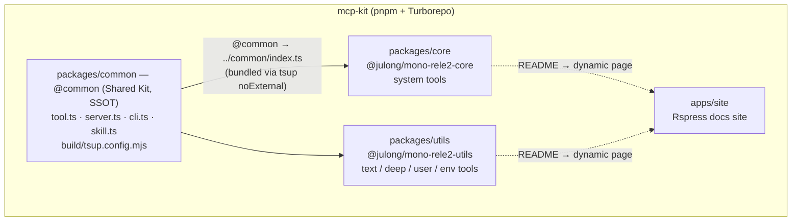
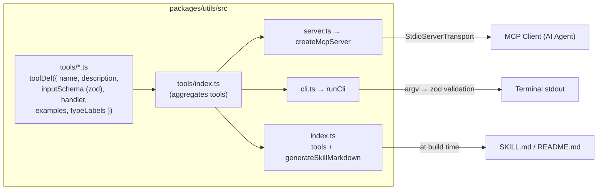
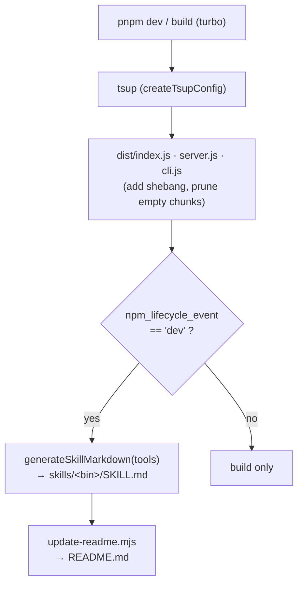
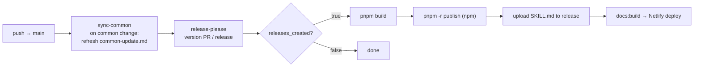

# 3. Project Architecture & Directory Roles

## Top-Level Directory Structure

```
mcp-kit/
├── apps/
│   └── site/           # Rspress documentation site (docs/ + README dynamic pages)
├── packages/
│   ├── common/         # Shared kit (not published to npm, excluded from workspace)
│   ├── core/           # @julong/mono-rele2-core — core system tools
│   └── utils/          # @julong/mono-rele2-utils — text/data utility tools
├── .github/workflows/  # CI/CD pipelines
├── package.json        # Root config (workspace definition)
├── turbo.json          # Turborepo task configuration
├── tsconfig.json       # Root TypeScript config
├── release-please-config.json      # release-please manifest config (per-package release setup)
├── .release-please-manifest.json   # Tracks current versions per package
├── CLAUDE.md           # Project context for AI assistants
└── pnpm-workspace.yaml # Workspace scope (excluding common)
```

## Layer Responsibilities

### `packages/common/` — Shared Kit (Internal Only, Not Published to npm)

**Explicitly excluded** via `!packages/common` in pnpm workspace. Handled via `noExternal: /^@common$/` in tsup config, bundling it into each package at build time.

```
common/
├── kit/
│   ├── tool.ts     # Tool definitions: toolDef(), defineTool(), AnyToolDef type, text() helper
│   ├── server.ts   # MCP server: createMcpServer(), startServer()
│   ├── cli.ts      # CLI execution: runCli(), handleCliError()
│   └── skill.ts    # Documentation generation: generateSkillMarkdown(), generateReadmeSkills()
├── build/
│   ├── tsup.config.mjs       # Common tsup config (createTsupConfig)
│   └── update-readme.mjs     # README generation script
├── types.ts        # Common types (Nullable, Optional, MaybePromise)
├── constants.ts    # Common constants (VERSION)
└── index.ts        # Public entry point (re-exports all kit/*)
```

### `packages/core/` — @julong/mono-rele2-core

```
core/
├── src/
│   ├── index.ts            # Library entry point (re-exports tools + generate*)
│   ├── server.ts           # MCP server entry point (stdio)
│   ├── cli.ts              # CLI entry point
│   └── tools/
│       ├── index.ts        # Tool re-exports
│       └── system.ts       # echoTool, timestampTool, envTool, uuidTool definitions
├── tsup.config.ts          # tsup config (reuses common config)
└── package.json            # npm package configuration
```

### `packages/utils/` — @julong/mono-rele2-utils

```
utils/
├── src/
│   ├── index.ts            # Library entry point (re-exports cn, tools, generate*)
│   ├── server.ts           # MCP server entry point (registers 6 tools)
│   ├── cli.ts              # CLI entry point
│   ├── cn.ts               # cn() utility function (classNames filtering)
│   └── tools/
│       ├── index.ts        # Tool re-exports (merges text + deep + user + env)
│       ├── text.ts         # cnTool, caseConvertTool, truncateTool definitions
│       ├── deep.ts         # objectFlattenTool — nested JSON dot-notation flattening
│       ├── user.ts         # getUserTool — RandomUser parsing and Korean sentence generation
│       └── env.ts          # envGetTool — MCP client env variable lookup + UTILS_ENV_KEYS
├── tsup.config.ts
└── package.json
```

### `apps/site/` — Rspress Documentation Site

```
site/
├── docs/                    # Static markdown docs (01-*.md ~ 10-*.md)
│   ├── index.md             # Home page (Rspress hero layout)
│   ├── en/                  # English documentation
│   ├── 01-project-overview.md
│   ├── ...
│   └── 10-commands.md
├── scripts/
│   └── package-docs-plugin.ts  # README → dynamic page transformation plugin
├── rspress.config.ts        # Rspress config (sidebar, nav, plugins, i18n)
├── netlify.toml             # Netlify deployment config
└── package.json             # @julong/mcp-kit-site (private)
```

`package-docs-plugin` scans `packages/*/README.md` to generate dynamic pages at `/packages/<name>` routes and automatically renders a package list table on the `/packages` overview page.

## Data Flow

```
Tool definitions (src/tools/*.ts)
  │
  ├──→ src/index.ts        ─→ tsup build ─→ dist/index.js   (Library)
  ├──→ src/server.ts       ─→ tsup build ─→ dist/server.js  (MCP Server)
  └──→ src/cli.ts          ─→ tsup build ─→ dist/cli.js     (CLI)

src/tools/*.ts
  ├──→ README.md (bun update-readme.mjs → imports tool source directly)
  └──→ dist/skills/*/skill.md (tsup onSuccess → imports dist/index.js)
```

**tsconfig path alias**: `@common` → `../common/index.ts` (configured in each package's tsconfig.json)

## Architecture Diagrams

### Package & Dependency Structure



> `packages/common` is excluded from the workspace and never published — it is inlined into each package at build time.

### Per-Package Internal Structure (utils example)



A single `tools` definition is consumed three ways: the MCP server (stdio), the CLI runner, and documentation/skill generation.

### Build & Documentation Generation Flow



### Release Pipeline (.github/workflows/release.yml)



## Separation of Concerns

1. **Tool definitions reside in each package's `src/tools/`** — business logic lives only here
2. **Common MCP server/CLI logic lives in `packages/common/kit/`** — server creation, CLI parsing, error handling
3. **Shared config files live in `packages/common/build/`** — tsup config, README generation script
4. **Each package's `src/server.ts`** is a thin layer that passes tool objects to `createMcpServer()`
5. **Each package's `src/cli.ts`** is a thin layer that passes tool objects to `runCli()`

## Adding New Features

- **New MCP server package**: Create `packages/<name>/` directory, define tools in `src/tools/*.ts`
- **New tool in existing package**: Add a file under the package's `src/tools/` (or add to an existing file)
- **New shared functionality**: Add a module under `packages/common/kit/`
- **Build config changes**: Modify `packages/common/build/tsup.config.mjs`
