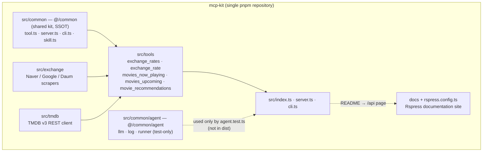
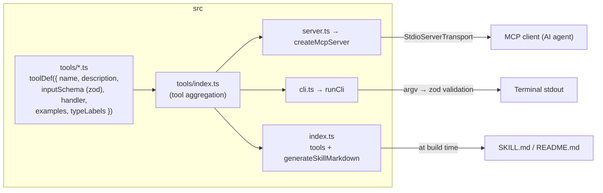
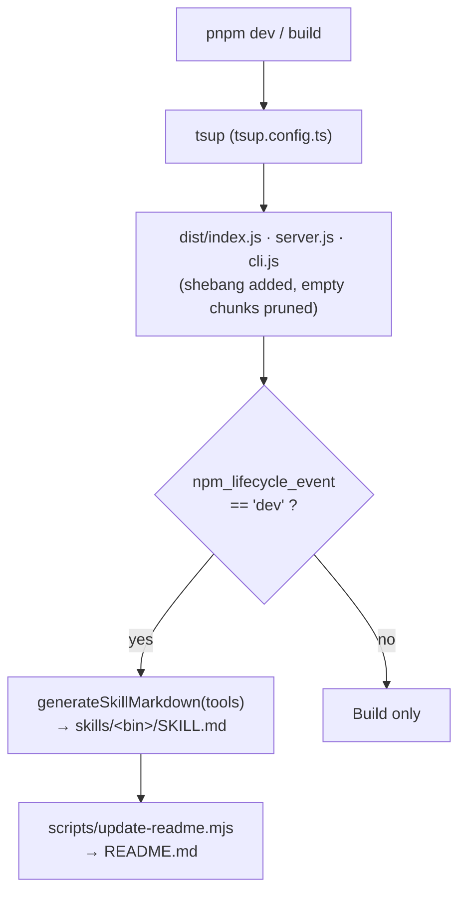
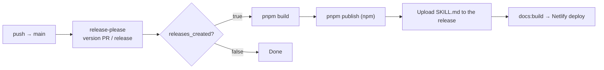

# 3. Project Architecture & Directory Roles

## Top-Level Directory Structure

```
mcp-kit/
├── src/
│   ├── index.ts        # Library entry point
│   ├── server.ts       # MCP server entry point (stdio)
│   ├── cli.ts          # CLI entry point
│   ├── agent.test.ts   # Real-LLM test (excluded from the default test run)
│   ├── tools/          # MCP tool definitions
│   ├── exchange/       # Exchange-rate scraping domain
│   ├── tmdb/           # TMDB movie lookup domain
│   └── common/         # Shared kit (never published separately, inlined into the bundle)
├── docs/               # Rspress documentation site content
├── scripts/            # README generation, Rspress plugin
├── skills/             # Generated SKILL.md
├── .github/workflows/  # CI/CD pipelines
├── package.json        # Single package config (@julong/mcp-kit)
├── tsconfig.json       # TypeScript config (@/* → src/*)
├── tsup.config.ts      # Bundling config
├── rstest.config.ts    # Test config
├── rslint.config.ts    # Lint config
├── rspress.config.ts   # Documentation site config
├── netlify.toml        # Netlify deployment config
├── release-please-config.json      # release-please config (single package)
├── .release-please-manifest.json   # Tracks the current version
└── CLAUDE.md           # Project context for AI assistants
```

## Layer Responsibilities

### `src/common/` — Shared Kit (Internal Only, Never Published Separately)

Not a separate package — just a module in the same source tree. `tsup` inlines it via `noExternal`, so it only exists inside the build output.

```
src/common/
├── kit/
│   ├── tool.ts     # Tool definitions: toolDef(), defineTool(), AnyToolDef type, text() helper
│   ├── server.ts   # MCP server: createMcpServer(), startServer(), installProcessGuards()
│   ├── cli.ts      # CLI execution: runCli(), handleCliError()
│   └── skill.ts    # Documentation generation: generateSkillMarkdown(), generateReadmeSkills()
├── agent/
│   ├── llm.ts      # createChatModel() — OpenAI-compatible chat model from env vars
│   ├── log.ts      # FileLogCallback, appendLog() — one .log file per taskId
│   ├── runner.ts   # runMcpAgent(), nodeMcpServer() — spawn MCP servers, run a deep agent
│   └── index.ts    # Agent-kit entry point (imported as `@/common/agent`, NOT via `@/common`)
├── .log/           # Agent run logs, one file per taskId (gitignored)
├── types.ts        # Common types (Nullable, Optional, MaybePromise)
├── constants.ts    # Common constants (VERSION)
└── index.ts        # Public entry point (re-exports all kit/*)
```

> `agent/` is deliberately **not** re-exported from `index.ts`. The build inlines every dependency
> via `noExternal`, so re-exporting it would drag langchain and deepagents into the published MCP
> server bundle. Consumers reach it through the separate `@/common/agent` path, and it stays out
> of `dist/`.
>
> This keeps the layering one-way: `src/common/agent` is the only place that assembles an agent —
> everything else ships MCP tools and nothing else. Proving the tools work under an LLM happens
> from a test that hands `@/common/agent` an MCP server and a prompt (see `src/agent.test.ts`).

### `src/tools/` — MCP Tool Definitions

```
src/tools/
├── index.ts        # tools re-export + UTILS_ENV_KEYS (env block in the generated README)
├── exchange.ts     # exchangeRatesTool, exchangeRateTool definitions
├── exchange.test.ts
├── movie.ts        # nowPlayingMoviesTool, upcomingMoviesTool, movieRecommendationsTool definitions
└── movie.test.ts
```

### `src/exchange/` — Exchange-Rate Scraping Domain

Opens Naver, Google, and Daum with Playwright and reads the rates directly. `playwright` resolves browser drivers from its own package directory at runtime, so it is left in `dependencies` and kept out of the bundle (marked `external` in `tsup.config.ts`).

```
src/exchange/
├── index.ts        # Parallel portal orchestration + timeout handling
├── types.ts        # Provider / CurrencyCode / ExchangeQuote definitions
├── parse.ts        # Number parsing, quoted-unit normalization, ExchangeQuote construction
├── wait.ts         # Waits until placeholder text is replaced by a real rate
├── browser.ts      # Chromium launch and browser context creation
└── providers/      # naver.ts · google.ts · daum.ts scrapers
```

### `src/tmdb/` — TMDB Movie Lookup Domain

Calls the [TMDB v3 REST API](https://developer.themoviedb.org/reference/intro/getting-started) over `fetch`. No browser and no extra dependency, so the whole domain is bundled like the rest of the source.

```
src/tmdb/
├── index.ts        # Domain entry point (re-exports)
├── types.ts        # TmdbMovie / MovieSummary / MovieListResult definitions and constants
├── client.ts       # Auth resolution, URL building, GET with a timeout
├── genres.ts       # Genre id → name table (cached per language), genre name resolution
├── normalize.ts    # Raw TMDB movie → MovieSummary
└── movies.ts       # now playing / upcoming / recommendation orchestration
```

Authentication comes from the environment: `TMDB_API_KEY` (v3 API key, sent as a query parameter) or `TMDB_ACCESS_TOKEN` (read access token, sent as a bearer header). When both are set the token wins, so the secret never lands in a URL.

### `docs/` + `rspress.config.ts` — Rspress Documentation Site

```
docs/                          # Static markdown docs (01-*.md ~ 10-*.md)
├── index.md                   # Home page (Rspress hero layout)
├── 01-project-overview.md
├── ...
├── 10-commands.md
└── ko/                        # Korean locale
scripts/readme-docs-plugin.ts  # README → /api page plugin
rspress.config.ts              # Rspress config (sidebar, nav, plugins)
netlify.toml                   # Netlify deployment config
```

`readme-docs-plugin` renders the root `README.md` generated by `pnpm readme` at the `/api` (and `/ko/api`) routes.

## End-to-End Data Flow

```
Tool definitions (src/tools/*.ts)
  │
  ├──→ src/index.ts        ─→ tsup build ─→ dist/index.js   (library)
  ├──→ src/server.ts       ─→ tsup build ─→ dist/server.js  (MCP server)
  └──→ src/cli.ts          ─→ tsup build ─→ dist/cli.js     (CLI)

src/tools/*.ts
  ├──→ README.md (bun scripts/update-readme.mjs → imports the tools source directly)
  └──→ skills/<bin>/SKILL.md (tsup onSuccess → imports dist/index.js)
```

**tsconfig path alias**: `@/*` → `./src/*` (root `tsconfig.json`; `rstest.config.ts` mirrors the same alias)

## Architecture Diagrams

### Module & Dependency Structure



> `src/common` is never published as its own package — it is inlined into the bundle at build time.

### Internal Source Structure



One `tools` definition is consumed three ways: the MCP server (stdio), the CLI runner, and doc/skill generation.

### Build & Documentation Generation Flow



### Release Pipeline (.github/workflows/release.yml)



## Separation of Concerns

1. **Tool definitions live in `src/tools/`** — the MCP-facing interface belongs only here
2. **Domain logic lives in `src/exchange/`** — scraping, parsing, timeout handling
3. **Shared MCP server/CLI logic lives in `src/common/kit/`** — server creation, CLI parsing, error handling
4. **`src/server.ts`** only passes the tool objects to `createMcpServer()` (a very thin layer)
5. **`src/cli.ts`** only passes the tool objects to `runCli()` (a very thin layer)

## Where to Add New Features

- **New tool**: add a file under `src/tools/` (or extend an existing one) and aggregate it in `src/tools/index.ts`
- **New portal/currency**: add a scraper under `src/exchange/providers/` and the constant in `src/exchange/types.ts`
- **New TMDB endpoint**: add the call in `src/tmdb/movies.ts` and the response type in `src/tmdb/types.ts`
- **New shared capability**: add a module under `src/common/kit/`
- **Build config changes**: edit the root `tsup.config.ts`
