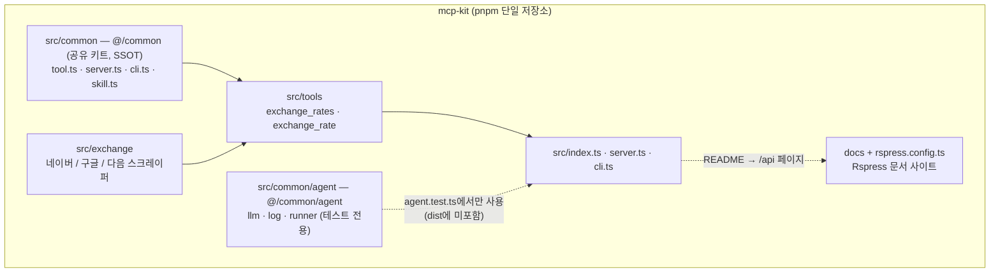
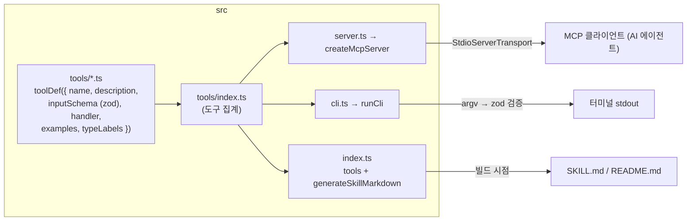
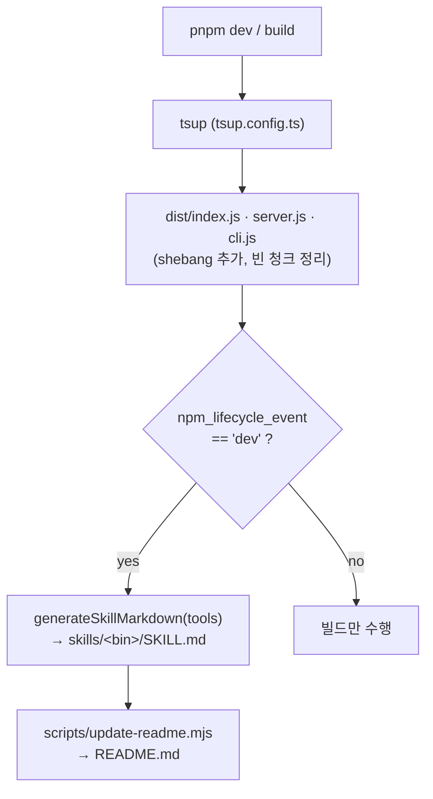
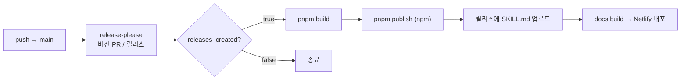

# 3. 프로젝트 아키텍처 및 디렉토리 역할

## 최상위 디렉토리 구조

```
mcp-kit/
├── src/
│   ├── index.ts        # 라이브러리 진입점
│   ├── server.ts       # MCP 서버 진입점 (stdio)
│   ├── cli.ts          # CLI 진입점
│   ├── agent.test.ts   # 실제 LLM 테스트 (기본 test에서 제외)
│   ├── tools/          # MCP 도구 정의
│   ├── exchange/       # 환율 스크레이핑 도메인
│   └── common/         # 공유 키트 (별도 배포 없음, 번들에 인라인)
├── docs/               # Rspress 문서 사이트 콘텐츠
├── scripts/            # README 생성, Rspress 플러그인
├── skills/             # 생성된 SKILL.md
├── .github/workflows/  # CI/CD 파이프라인
├── package.json        # 단일 패키지 설정 (@julong/mcp-kit)
├── tsconfig.json       # TypeScript 설정 (@/* → src/*)
├── tsup.config.ts      # 번들 설정
├── rstest.config.ts    # 테스트 설정
├── rslint.config.ts    # 린트 설정
├── rspress.config.ts   # 문서 사이트 설정
├── netlify.toml        # Netlify 배포 설정
├── release-please-config.json      # release-please 설정 (단일 패키지)
├── .release-please-manifest.json   # 현재 버전 추적
└── CLAUDE.md           # AI 어시스턴트용 프로젝트 컨텍스트
```

## 계층별 책임 분리

### `src/common/` — 공유 키트 (내부 전용, 별도 배포 없음)

별도 패키지가 아니라 같은 소스 트리의 모듈입니다. `tsup`이 `noExternal`로 전부 인라인하므로 빌드 결과물 안에만 존재합니다.

```
src/common/
├── kit/
│   ├── tool.ts     # 도구 정의: toolDef(), defineTool(), AnyToolDef 타입, text() 헬퍼
│   ├── server.ts   # MCP 서버: createMcpServer(), startServer(), installProcessGuards()
│   ├── cli.ts      # CLI 실행: runCli(), handleCliError()
│   └── skill.ts    # 문서 생성: generateSkillMarkdown(), generateReadmeSkills()
├── agent/
│   ├── llm.ts      # createChatModel() — 환경 변수로 OpenAI 호환 채팅 모델 생성
│   ├── log.ts      # FileLogCallback, appendLog() — taskId별 .log 파일 기록
│   ├── runner.ts   # runMcpAgent(), nodeMcpServer() — MCP 서버 기동 + deep agent 실행
│   └── index.ts    # 에이전트 키트 진입점 (`@/common`이 아닌 `@/common/agent`로 사용)
├── .log/           # 에이전트 실행 로그, taskId별 파일 (gitignore 대상)
├── types.ts        # 공통 타입 (Nullable, Optional, MaybePromise)
├── constants.ts    # 공통 상수 (VERSION)
└── index.ts        # 공개 진입점 (kit/* 전체 re-export)
```

> `agent/`는 의도적으로 `index.ts`에서 **재노출하지 않습니다**. 빌드가 `noExternal`로 모든 의존성을
> 인라인하기 때문에, 재노출하면 langchain·deepagents가 배포되는 MCP 서버 번들에 끌려 들어갑니다.
> 쓰는 쪽에서 `@/common/agent` 경로로 직접 가져오며, `dist/`에는 포함되지 않습니다.
>
> 이렇게 해서 계층이 한 방향으로 유지됩니다. 에이전트를 조립하는 곳은 `src/common/agent` 하나뿐이고,
> 나머지 소스는 MCP 도구만 제공합니다. 도구를 LLM으로 검증하고 싶으면 테스트에서
> `@/common/agent`에 MCP 서버와 프롬프트를 넘겨 실행합니다 (`src/agent.test.ts` 참고).

### `src/tools/` — MCP 도구 정의

```
src/tools/
├── index.ts        # tools re-export
├── exchange.ts     # exchangeRatesTool, exchangeRateTool 정의
└── exchange.test.ts
```

### `src/exchange/` — 환율 스크레이핑 도메인

Playwright로 네이버·구글·다음을 직접 열어 환율을 읽어옵니다. `playwright`는 실행 시점에 브라우저 드라이버를 자기 패키지 경로에서 찾으므로 번들하지 않고 `dependencies`로 남겨 둡니다 (`tsup.config.ts`에서 `external` 처리).

```
src/exchange/
├── index.ts        # 포털 병렬 수집 오케스트레이션 + 타임아웃 처리
├── types.ts        # Provider / CurrencyCode / ExchangeQuote 정의
├── parse.ts        # 숫자 파싱 · 고시 단위 역산 · ExchangeQuote 생성
├── wait.ts         # 자리표시자가 실제 시세로 바뀔 때까지 대기
├── browser.ts      # Chromium 기동 및 브라우저 컨텍스트 생성
└── providers/      # naver.ts · google.ts · daum.ts 스크레이퍼
```

### `docs/` + `rspress.config.ts` — Rspress 문서 사이트

```
docs/                        # 정적 마크다운 문서 (01-*.md ~ 10-*.md)
├── index.md                 # 홈 페이지 (Rspress hero layout)
├── 01-project-overview.md
├── ...
├── 10-commands.md
└── ko/                      # 한국어 로케일
scripts/readme-docs-plugin.ts  # README → /api 페이지 변환 플러그인
rspress.config.ts            # Rspress 설정 (sidebar, nav, plugins)
netlify.toml                 # Netlify 배포 설정
```

`readme-docs-plugin`이 `pnpm readme`로 생성된 루트 `README.md`를 `/api`(및 `/ko/api`) 라우트에 렌더링합니다.

## 전체 데이터 흐름

```
도구 정의 (src/tools/*.ts)
  │
  ├──→ src/index.ts        ─→ tsup build ─→ dist/index.js   (라이브러리)
  ├──→ src/server.ts       ─→ tsup build ─→ dist/server.js  (MCP 서버)
  └──→ src/cli.ts          ─→ tsup build ─→ dist/cli.js     (CLI)

src/tools/*.ts
  ├──→ README.md (bun scripts/update-readme.mjs → tools 소스 직접 import)
  └──→ skills/<bin>/SKILL.md (tsup onSuccess → dist/index.js import)
```

**tsconfig path alias**: `@/*` → `./src/*` (루트 `tsconfig.json`, `rstest.config.ts`가 동일 별칭을 미러링)

## 아키텍처 다이어그램

### 모듈 및 의존 구조



> `src/common`은 별도 패키지로 배포되지 않고 빌드 시 번들에 인라인됩니다.

### 소스 내부 구조



하나의 `tools` 정의가 세 가지로 소비됩니다: MCP 서버(stdio), CLI 실행기, 문서/스킬 생성.

### 빌드 및 문서 생성 흐름



### 릴리스 파이프라인 (.github/workflows/release.yml)



## 관심사 분리 원칙

1. **도구 정의는 `src/tools/`** 에서 담당 — MCP에 노출할 인터페이스는 여기에만 위치
2. **도메인 로직은 `src/exchange/`** 에서 담당 — 스크레이핑·파싱·타임아웃 처리
3. **MCP 서버/CLI 공통 로직은 `src/common/kit/`** 에서 담당 — 서버 생성, CLI 파싱, 에러 처리 등
4. **`src/server.ts`** 는 도구 객체를 `createMcpServer()`에 전달하는 역할만 수행 (매우 얇은 레이어)
5. **`src/cli.ts`** 는 도구 객체를 `runCli()`에 전달하는 역할만 수행 (매우 얇은 레이어)

## 신규 기능 추가 위치

- **새 도구 추가**: `src/tools/` 하위에 파일 추가 (또는 기존 파일에 추가) 후 `src/tools/index.ts`에 집계
- **새 포털/통화 추가**: `src/exchange/providers/`에 스크레이퍼 추가, `src/exchange/types.ts`에 상수 추가
- **공통 기능 추가**: `src/common/kit/`에 모듈 추가
- **빌드 설정 변경**: 루트 `tsup.config.ts` 수정
